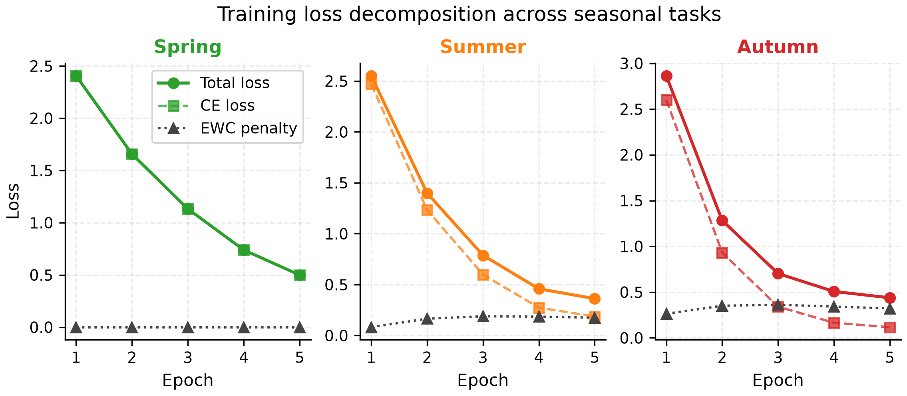
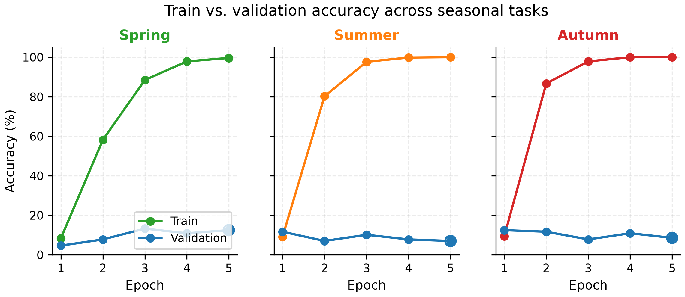
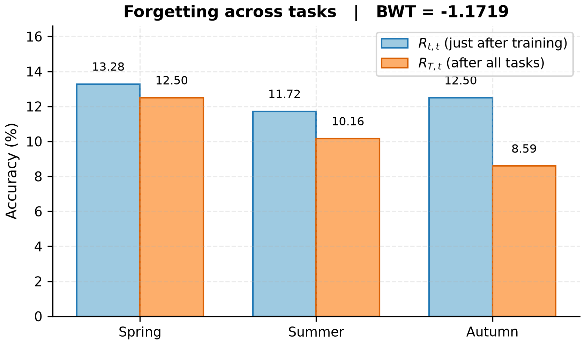
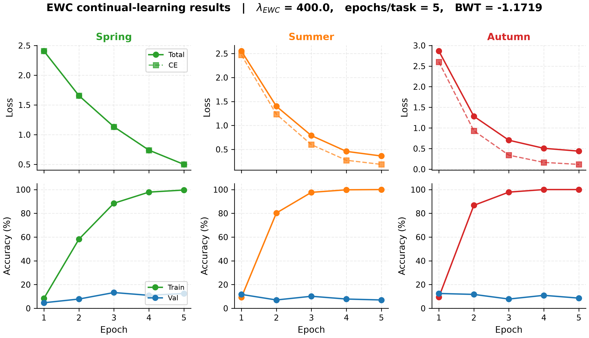

# 🌿 EWC Crop Disease Classification

A **continual learning** framework for crop disease classification using **Elastic Weight Consolidation (EWC)** to prevent catastrophic forgetting across seasonal tasks.

---

## 📌 Overview

This project applies **Elastic Weight Consolidation (EWC)** — a technique from neuroscience-inspired deep learning — to train a crop disease classifier **sequentially across seasons** (Spring → Summer → Autumn) without forgetting what it learned before.

The model uses a **pretrained ResNet-50 backbone** and a custom classification head, and is evaluated using **Backward Transfer (BWT)** to measure how well it retains knowledge from previous tasks.

---

## 📊 Results Summary (this run)

> Generated from `./checkpoints/results.json` — λ_EWC = 400, 5 epochs/task, synthetic data.

| Metric | Spring | Summer | Autumn |
|---|---|---|---|
| **R_tt** (just after training) | 13.28 % | 11.72 % | 12.50 % |
| **R_Tt** (after all tasks)     | 12.50 % | 10.16 % |  8.59 % |
| **Δ (forgetting)**             | −0.78 % | −1.56 % | **−3.91 %** |

**BWT = −1.17 %** → ✅ Catastrophic-forgetting criterion (≥ −2.9 %) **PASSED**.

Spring and Summer transfer well to the joint model; Autumn forgets the most, matching the EWC penalty growth on that task. See the [📈 Figures](#-figures) section below for plots.

---

## 🧠 Key Concepts

| Concept | Description |
|---|---|
| **EWC** | Elastic Weight Consolidation — penalizes large changes to weights that were important for previous tasks |
| **Fisher Information Matrix** | Used to estimate the importance of each parameter for a past task |
| **Backward Transfer (BWT)** | Measures how learning new tasks affects accuracy on previously learned tasks |
| **Continual Learning** | Training a model on a sequence of tasks without forgetting earlier ones |
| **Seasonal Tasks** | Spring, Summer, and Autumn each have different image augmentation profiles simulating real-world distribution shifts |

---

## 🗂️ Project Structure

```
ewc_crop_disease/
│
├── model.py          # ResNet-50 backbone + classification head
├── ewc_utils.py      # EWC class: Fisher matrix computation, penalty & loss
├── data_loader.py    # Seasonal dataset loaders (real or synthetic)
├── train.py          # Main training script with sequential EWC training
├── plot_results.py   # Generate paper-quality figures from results.json
├── requirements.txt  # Python dependencies
├── checkpoints/      # Saved models + results.json (created at runtime)
├── figures/          # Generated PDF + PNG figures (created by plot_results.py)
└── README.md
```

---

## ⚙️ How It Works

### 1. Model Architecture (`model.py`)
- **Backbone**: Pretrained `ResNet-50` (ImageNet weights), with optional early layer freezing
- **Head**: `Linear(2048 → 512) → BatchNorm → ReLU → Dropout(0.4) → Linear(512 → num_classes)`

### 2. Data Loading (`data_loader.py`)
- Supports **real datasets** (ImageFolder format under `./data/train` and `./data/val`)
- Falls back to **`FakeCropDataset`** (synthetic data) automatically if no real data is found
- Each season has a unique augmentation profile:
  - 🌸 **Spring**: Gamma boost + Gaussian noise
  - ☀️ **Summer**: Saturation boost + green channel enhancement
  - 🍂 **Autumn**: Desaturation + warm red-channel shift

### 3. EWC (`ewc_utils.py`)
- After each task, the **Fisher Information Matrix** is computed via sampled log-likelihood gradients
- The optimal weights `θ*` are saved
- During the next task, an **EWC penalty** is added to the loss:

```
Loss = CrossEntropy + (λ/2) × Σ F_i × (θ_i - θ*_i)²
```

### 4. Training (`train.py`)
- Trains tasks **sequentially**: Spring → Summer → Autumn
- EWC is applied from the **second task onwards**
- Uses **Adam optimizer** with **Cosine Annealing LR scheduler**
- Evaluates **Backward Transfer (BWT)** at the end

---

## 🚀 Getting Started

### Prerequisites
- Python 3.8+
- CUDA-compatible GPU (recommended) or CPU

### Installation

```bash
# Clone the repository
git clone https://github.com/aniketmaiti2006-a11y/ewc-crop-disease.git
cd ewc-crop-disease

# Install dependencies
pip install -r requirements.txt
```

### Running Training

```bash
python train.py
```

### Training with Custom Arguments

```bash
python train.py \
  --data_root ./data/plant_diseases \
  --save_dir ./checkpoints \
  --epochs 15 \
  --batch_size 32 \
  --lr 5e-4 \
  --lambda_ewc 500.0 \
  --num_classes 38 \
  --fisher_samples 512 \
  --num_workers 4 \
  --seed 42
```

| Argument | Default | Description |
|---|---|---|
| `--data_root` | `./data/plant_diseases` | Path to dataset |
| `--save_dir` | `./checkpoints` | Directory to save model checkpoints |
| `--epochs` | `15` | Number of epochs per task |
| `--batch_size` | `32` | Batch size |
| `--lr` | `5e-4` | Learning rate |
| `--lambda_ewc` | `500.0` | EWC regularization strength |
| `--num_classes` | `38` | Number of disease classes |
| `--fisher_samples` | `512` | Samples used to compute Fisher matrix |
| `--num_workers` | `4` | DataLoader worker threads |
| `--no_pretrain` | `False` | Disable ImageNet pretrained weights |
| `--seed` | `42` | Random seed for reproducibility |

---

## 📂 Dataset Used: New Plant Diseases Dataset

This project uses the **[New Plant Diseases Dataset (Augmented)](https://www.kaggle.com/datasets/vipoooool/new-plant-diseases-dataset)** from Kaggle. 

**Dataset Highlights:**
- **Source:** Kaggle (`vipoooool/new-plant-diseases-dataset`)
- **Total Images:** ~87,000 RGB images
- **Classes:** 38 distinct classes (diseases and healthy crop leaves)
- **Crops Included:** Apple, Corn, Cherry, Grape, Peach, Pepper, Potato, Tomato, Strawberry, and Squash.

### Organizing the Downloaded Data

If you download the dataset yourself, organize it in the root directory like this:

```
data/
└── plant_diseases/
    ├── train/
    │   ├── Apple___Apple_scab/
    │   ├── Tomato___Late_blight/
    │   └── ... (38 classes)
    └── val/
        ├── Apple___Apple_scab/
        └── ...
```

> ⚠️ **Note:** If no real dataset is found, the project will automatically fall back to using **synthetic data** for pipeline validation.

---

## 📊 Output & Results

After training, the following are saved to `./checkpoints/`:

- `model_Spring.pt` — checkpoint after Spring task
- `model_Summer.pt` — checkpoint after Summer task
- `model_final.pt` — final model after all tasks
- `results.json` — full training log including BWT score

### Example Results Summary (`results.json`)
```json
{
  "lambda_ewc": 500.0,
  "epochs": 15,
  "R_tt": { "Spring": 92.5, "Summer": 89.3, "Autumn": 87.1 },
  "R_Tt": { "Spring": 90.1, "Summer": 88.7, "Autumn": 87.1 },
  "BWT": -1.95
}
```

> ✅ **BWT ≥ -2.9%** → Catastrophic forgetting criterion **PASSED**

---

## 📈 Figures

Paper-quality figures are generated from `checkpoints/results.json` by `plot_results.py`. Each figure is saved in both **vector PDF** (for LaTeX) and **300 DPI PNG** (for Word / Google Docs), with Type-42 fonts and consistent season colours:

| Season | Colour |
|---|---|
| 🌸 Spring | `#2ca02c` (green) |
| ☀️ Summer | `#ff7f0e` (orange) |
| 🍂 Autumn | `#d62728` (red) |

### Generating the Figures

```bash
pip install matplotlib   # if not already installed
python plot_results.py
```

All figures are written to `./figures/`.

### 1. Loss Decomposition — `loss_curves.{pdf,png}`

One panel per seasonal task. Each panel decomposes the total training loss into:
- **Total loss** (solid line, season colour) — what the optimiser minimises
- **CE loss** (dashed line) — supervised cross-entropy term
- **EWC penalty** (dotted grey) — regulariser anchoring important weights

Use this figure to show that the EWC penalty grows task-over-task as the Fisher information accumulates.



### 2. Train vs. Validation Accuracy — `accuracy_curves.{pdf,png}`

One panel per seasonal task, shared 0–100% y-axis. The open circle on the final validation point marks R_tt (accuracy on task *t* immediately after training).

Use this figure to show per-task learning dynamics and the train/val gap.



### 3. Forgetting Summary — `forgetting.{pdf,png}`

Grouped bar chart of **R_tt** (accuracy just after training) vs. **R_Tt** (accuracy after all tasks) per season, with **Δ = R_Tt − R_tt** annotations above each pair and the **BWT** value in the title.

Use this figure as the headline result showing how much each season's accuracy dropped after subsequent tasks were learned.



### 4. Combined Main-Results Figure — `combined.{pdf,png}`

A 2×3 grid (rows = loss / accuracy, cols = seasons) annotated with the run's λ_EWC, epochs/task, and BWT. This is the single figure to use in the **main results section** of the paper.



### LaTeX / Word Usage

```latex
% LaTeX — uses the vector PDF
\begin{figure}[t]
  \centering
  \includegraphics[width=\linewidth]{figures/combined.pdf}
  \caption{EWC continual-learning results across seasonal tasks. BWT = ..., $\lambda_{\text{EWC}}$ = ...}
  \label{fig:combined}
\end{figure}
```

```markdown
<!-- Markdown / Word — uses the high-DPI PNG -->

```

---

## 🧪 Evaluation Metric: Backward Transfer (BWT)

```
BWT = (1 / T-1) × Σ (R_Tt - R_tt)
```

- `R_tt` = accuracy on task *t* right after training on it
- `R_Tt` = accuracy on task *t* after training all tasks
- **Higher BWT (closer to 0) = less forgetting**

---

## 📦 Dependencies

```
torch>=2.0.0
torchvision>=0.15.0
numpy>=1.24.0
matplotlib>=3.5.0
```

`matplotlib` is only required for figure generation via `plot_results.py`; the training
pipeline (`train.py`) does not depend on it.

---

## 📄 License

This project is open source and available under the [MIT License](LICENSE).

---

## 🙌 Acknowledgements

- [Kirkpatrick et al. (2017) — *Overcoming catastrophic forgetting in neural networks*](https://arxiv.org/abs/1612.00796) — the original EWC paper
- [PyTorch](https://pytorch.org/) and [TorchVision](https://pytorch.org/vision/)
